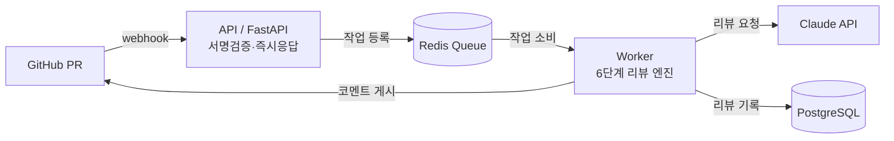
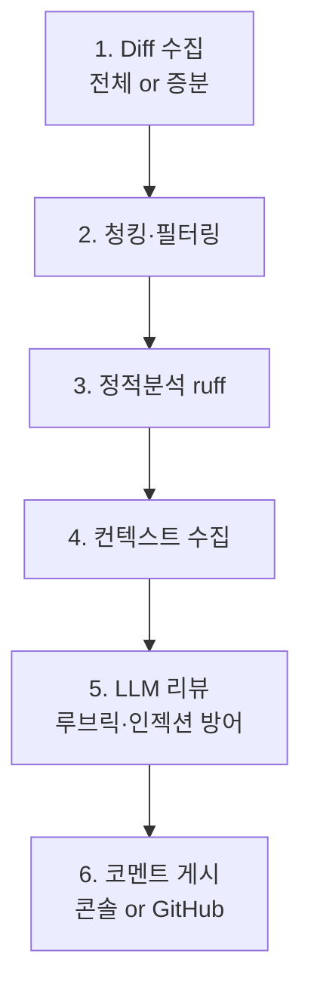

# 🧙 CodeSage – AI Code Review Agent

> **Your AI pair-reviewer on every PR.**
> GitHub PR이 열리면 변경된 코드를 자동 분석해 인라인 리뷰와 요약을 달아주는 AI 에이전트. (CodeRabbit 벤치마킹)

[]()
[]()
[]()

---

## ✨ 핵심 기능

| | 기능 | 상태 |
|---|---|---|
| ① | PR 요약 + 파일별 변경표 | ✅ |
| ② | 인라인 리뷰 (버그/보안/성능/스타일) | ✅ |
| ③ | 정적 분석(ruff) 통합 | ✅ |
| ④ | 증분 리뷰 (새 커밋만 재리뷰) | ✅ |
| ⑤ | 대화형 후속 (`@codesage` 멘션에 AI 답변) | ✅ |
| ⑥ | 컨벤션 학습 (RAG) | 📋 로드맵 |

---

## 🏗️ 아키텍처



리뷰 엔진 6단계:



- **수신과 처리를 분리**: Webhook은 즉시 200 응답(타임아웃 회피), 무거운 리뷰는 Worker가 큐에서 꺼내 처리.
- **Diff 중심 리뷰**: 변경된 부분만 LLM에 투입해 토큰/비용 절감.
- **모드 어댑터**: 같은 파이프라인이 운영 모드(GitHub)와 로컬 시연 모드(콘솔)를 모두 처리.

상세 설계는 [프로젝트.md](프로젝트.md) 참고.

---

## 🚀 빠른 시작 (로컬 시연 — GitHub/키 없이도 동작)

```bash
# 1) 환경변수 준비
cp .env.example .env          # ANTHROPIC_API_KEY는 비워둬도 mock 리뷰로 동작

# 2) 의존성 설치
pip install -r requirements.txt

# 3) (터미널 A) API 서버
uvicorn app.main:app --reload

# 4) (터미널 B) Worker
python -m app.queue.worker      # ※ Redis 필요. 없으면 docker compose 사용 권장

# 5) (터미널 C) 가짜 PR 전송
python scripts/send_fake_pr.py --diff samples/buggy_login.py.diff
```

Worker 터미널에 리뷰 결과가 출력됩니다:

```
============================================================
## 🧙 CodeSage Review
로그인 함수에 SQL Injection과 하드코딩된 시크릿 취약점이 있습니다.
발견: 🔴 Critical 2 · 🟡 Warning 0 · 💡 Suggestion 1
============================================================
🔴 [security] auth.py:5
   JWT 시크릿이 하드코딩되어 있습니다. 환경변수로 분리하세요.
🔴 [security] auth.py:8
   문자열 결합 쿼리는 SQL Injection에 취약합니다. parameterized query를 쓰세요.
============================================================
```

> `ANTHROPIC_API_KEY`를 넣지 않으면 `[MOCK]` 리뷰가 나옵니다. 키를 넣으면 실제 Claude 리뷰가 생성됩니다.

---

## 🐳 Docker로 풀스택 실행

```bash
cp .env.example .env
docker compose up -d            # api + worker + redis + postgres

# 가짜 PR 전송
python scripts/send_fake_pr.py --diff samples/buggy_login.py.diff
docker compose logs -f worker   # 리뷰 결과 확인
```

---

## 🔌 실제 GitHub 연동 (운영 모드)

1. **GitHub App 생성**: Settings → Developer settings → New GitHub App
   - 권한: `Pull requests: Read & Write`, `Issues: Read & Write`, `Contents: Read-only`
   - 이벤트 구독: `Pull request`, `Issue comment`, `Pull request review comment`
   - Webhook URL: `https://<your-server>/webhook` / secret → `.env`의 `WEBHOOK_SECRET`
   - **App ID + Private key(.pem)** 확보
2. `.env`에 `GITHUB_APP_ID`, `GITHUB_APP_PRIVATE_KEY_PATH`, `ANTHROPIC_API_KEY` 입력
   (App을 안 쓰면 `GITHUB_TOKEN`(PAT)으로 폴백 가능)
3. 서버 배포 후 App을 리뷰받을 레포에 **Install** — 설치 토큰은 자동 발급됩니다.
4. 끝 — 이후 그 레포의 PR은 자동 리뷰되고, 코멘트에 `@codesage`로 질문하면 답합니다.

> 📖 권한 설정·인증 방식·ngrok 로컬 테스트·트러블슈팅 전체 절차는
> **[docs/github-app-setup.md](docs/github-app-setup.md)** 참고.

---

## ⚙️ 리뷰 정책 커스터마이징

코드 수정 없이 [`config/codesage.yaml`](config/codesage.yaml)만 바꾸면 됩니다.

```yaml
review:
  focus: [security, bug, performance, style]  # 중점 관점
  ignore: ["*.lock", "dist/**"]               # 리뷰 제외 파일
  min_severity: "warning"                      # 사소한 코멘트 끄기
  guidelines: |                                # 팀 컨벤션 주입
    - 모든 함수에 type hint 사용
    - DB 쿼리는 parameterized query 사용
```

---

## 🧪 테스트

```bash
pytest          # 55개 테스트
```

| 파일 | 커버리지 |
|---|---|
| `test_security.py` | HMAC 서명 검증 (위조/None/정상) |
| `test_diff_parser.py` | diff 분해·필터링·줄번호 추적 |
| `test_static_analysis.py` | 변경 후 파일 재구성 + ruff 실제 실행 |
| `test_llm_reviewer.py` | 프롬프트 조립·인젝션 격리·JSON 방어 파싱 |
| `test_incremental.py` | 증분 리뷰 판단 + diff 모드 분기 |
| `test_webhook.py` | Webhook HTTP 경로 (서명·이벤트 필터·큐 등록) |
| `test_comment_poster.py` | 콘솔/GitHub 게시 + 심각도 정렬 |
| `test_pipeline.py` | 로컬 모드 전체 흐름 (mock LLM) |
| `test_github_auth.py` | App JWT(RS256)·설치 토큰 발급·캐싱·PAT 폴백 |
| `test_followup.py` | 멘션 트리거·루프 방지·답변 게시 경로 |
| `test_worker_dispatch.py` | 큐 작업 타입 분기 (review/followup) |

---

## 📂 프로젝트 구조

```
codesage/
├── app/
│   ├── api/         # webhook 수신, health
│   ├── core/        # 설정, 보안(HMAC)
│   ├── queue/       # producer(등록) / worker(처리)
│   ├── review/      # ★ 리뷰 엔진 6단계
│   ├── integrations/# GitHub API 클라이언트
│   ├── models/      # Pydantic 스키마 + ORM
│   └── db/          # 세션/영속화
├── config/codesage.yaml
├── scripts/send_fake_pr.py
├── tests/
├── docker-compose.yml
└── Dockerfile
```

---

## 🗺️ 로드맵

- [x] 정적 분석 ruff 통합 (eslint 어댑터 포함)
- [x] 증분 리뷰 (synchronize 시 변경분만)
- [x] 프롬프트 인젝션 방어 + API 오류 우아한 처리
- [x] GitHub App Installation Token 자동 발급 (JWT→설치 토큰, 캐싱·PAT 폴백)
- [x] 대화형 후속 (`@codesage` 멘션 → AI 답변, 인라인 스레드/PR 대화)
- [ ] 운영 모드 Contents API 전체 파일 fetch (Linter 정확도↑)
- [ ] RAG 기반 레포 컨벤션 학습
- [ ] 리뷰 품질 평가 루프 (👍/👎 → 프롬프트 개선)
- [ ] 비용 대시보드 (토큰/시간 시각화)

---

*CodeSage v0.1.0 — Built with FastAPI + Claude*
